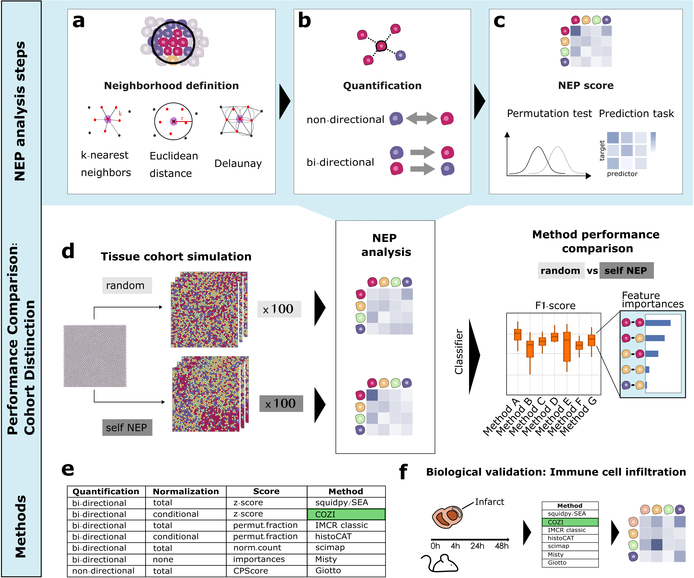

# Comparison and Optimization of Cellular Neighbor Preference (NEP) Methods for Quantitative Tissue Analysis
Author: Chiara Schiller

## Introduction
Studying the spatial distribution of cell types in tissues is essential for understanding their function in health and disease. A widely used spatial feature for quantifying tissue organization is the pairwise neighbor preference (NEP) of cell types, also termed co-occurrence or colocalization. Various methods to infer NEPs have proved their utility in numerous biological studies, but despite their broad usage in the spatial biology community, no clear guidelines exist for selecting one method over the other. In this github repository, we study the methods on two aspects: (1) their discriminatory power to distinguish different tissue architectures and (2) their ability to recover the directionality of NEPs. We conducted method performance comparison with in silico tissue simulated data and showcased its biological applicability to a myocardial infarction dataset studying immune cell infiltration. The method results used in this github repository can be generated with the linked method specific github repositories.

## This repository
We systematically compared the NEP methods Giotto, IMCRtools (classic and histoCAT), MISTy, SEA, Squidpy, Scimap and our newly proposed method COZI. In this repo, we load the NEP results of different tissue organization cohorts (repo: IST_generation) and perform binary classification between two cohorts with differing tissue organization parameters. We perfom the classification with a random forest classifier. Further, we evaluate the distinction performance with the F1 score and the cosine similarity between the feature importances and ground-truth cell-cell adjacency vectors. We further explore the NEP methods on a myocardial infarction dataset

### Structure
notebooks: 
- IST_data_comparison
    - NEP_symmetric_IST_comparison.Rmd: Loads all NEP result files of the symmetric IST cohorts, performs cohort classification and contains all code to reproduce the Figures in the Schiller et al. (2025) manuscript. 
    - NEP_asymmetric_IST_comparison.Rmd: Loads all NEP result files of the asymmetric IST cohorts, performs cohort classification and contains all code to reproduce the Figures in the Schiller et al. (2025) manuscript. 
    
- MI_data_comparison
    - NEP_MI_heart_comparison.Rmd: Loads all NEP result files of the MI dataset, explores the raw NEP scores of NEPs of interest and contains all code to reproduce the Figures in the Schiller et al. (2025) manuscript. 

### How to run
Please clone this github repository. Input data for simulation and MI data NEP result analysis are .csv files of NEP results generated in these github repositories:

- https://github.com/SchapiroLabor/NEP_Giotto
- https://github.com/SchapiroLabor/NEP_IMCRtools
- https://github.com/SchapiroLabor/NEP_Scimap (TO UPDATE)
- https://github.com/SchapiroLabor/NEP_Squidpy
- https://github.com/SchapiroLabor/Misty_SCNA

The structure of the NEP results are samples (rows) by NEP pairs (columns). The data folder containing all results of one experiment can be specified at the beginning of the script. 

The naming convention of the samples is crucial for comparison and would need to be adapted for other comparisons.
Our naming of samples is: 

"cross01_0.45_ab0_0.05_13.csv"

Translation: 

"preference_preferencestrength_abundancecelltype_abundance_samplenumber.csv"

### Specific run parameters

R version 4.3.2 (2023-10-31)
Platform: aarch64-apple-darwin20 (64-bit)
Running under: macOS Sonoma 14.2.1

Matrix products: default
BLAS:   /System/Library/Frameworks/Accelerate.framework/Versions/A/Frameworks/vecLib.framework/Versions/A/libBLAS.dylib 
LAPACK: /Library/Frameworks/R.framework/Versions/4.3-arm64/Resources/lib/libRlapack.dylib;  LAPACK version 3.11.0

locale:
[1] en_US.UTF-8/en_US.UTF-8/en_US.UTF-8/C/en_US.UTF-8/en_US.UTF-8

time zone: Europe/Berlin
tzcode source: internal

attached base packages:
[1] parallel  stats     graphics  grDevices utils     datasets  methods   base     

other attached packages:
 [1] doRNG_1.8.6           rngtools_1.5.2        randomForest_4.7-1.1  doParallel_1.0.17     iterators_1.0.14      foreach_1.5.2         factoextra_1.0.7      gridExtra_2.3         caret_6.0-94          lattice_0.21-9        randomForestSRC_3.2.2
[12] ggfortify_0.4.16      corrr_0.4.4           ggcorrplot_0.1.4.1    FactoMineR_2.9        pheatmap_1.0.12       cowplot_1.1.1         ggvoronoi_0.8.6       future_1.33.0         magrittr_2.0.3        lubridate_1.9.3       forcats_1.0.0        
[23] stringr_1.5.0         dplyr_1.1.3           purrr_1.0.2           readr_2.1.4           tidyr_1.3.0           tibble_3.2.1          ggplot2_3.4.4         tidyverse_2.0.0       mistyR_1.10.0        

loaded via a namespace (and not attached):
 [1] deldir_1.0-9         pROC_1.18.5          rlang_1.1.2          compiler_4.3.2       vctrs_0.6.4          reshape2_1.4.4       pkgconfig_2.0.3      crayon_1.5.2         fastmap_1.1.1        utf8_1.2.4           rmarkdown_2.25       prodlim_2023.08.28  
[13] tzdb_0.4.0           bit_4.0.5            xfun_0.41            jsonlite_1.8.7       flashClust_1.01-2    recipes_1.0.8        terra_1.7-55         data.tree_1.1.0      cluster_2.1.4        R6_2.5.1             stringi_1.7.12       RColorBrewer_1.1-3  
[25] parallelly_1.36.0    rpart_4.1.21         estimability_1.4.1   Rcpp_1.0.11          knitr_1.45           future.apply_1.11.0  Matrix_1.6-1.1       splines_4.3.2        nnet_7.3-19          timechange_0.2.0     tidyselect_1.2.0     rstudioapi_0.15.0   
[37] yaml_2.3.7           timeDate_4022.108    codetools_0.2-19     listenv_0.9.0        plyr_1.8.9           withr_2.5.2          evaluate_0.23        survival_3.5-7       pillar_1.9.0         DiagrammeR_1.0.10    DT_0.30              stats4_4.3.2        
[49] generics_0.1.3       vroom_1.6.4          sp_2.1-1             hms_1.1.3            munsell_0.5.0        scales_1.2.1         globals_0.16.2       xtable_1.8-4         leaps_3.1            class_7.3-22         glue_1.6.2           emmeans_1.8.9       
[61] scatterplot3d_0.3-44 tools_4.3.2          data.table_1.14.8    ModelMetrics_1.2.2.2 gower_1.0.1          visNetwork_2.1.2     mvtnorm_1.2-4        grid_4.3.2           ipred_0.9-14         colorspace_2.1-0     nlme_3.1-163         raster_3.6-26       
[73] cli_3.6.1            fansi_1.0.5          lava_1.7.3           gtable_0.3.4         digest_0.6.33        ggrepel_0.9.4        htmlwidgets_1.6.2    htmltools_0.5.7      lifecycle_1.0.4      hardhat_1.3.0        multcompView_0.1-9   bit64_4.0.5         
[85] MASS_7.3-60         
