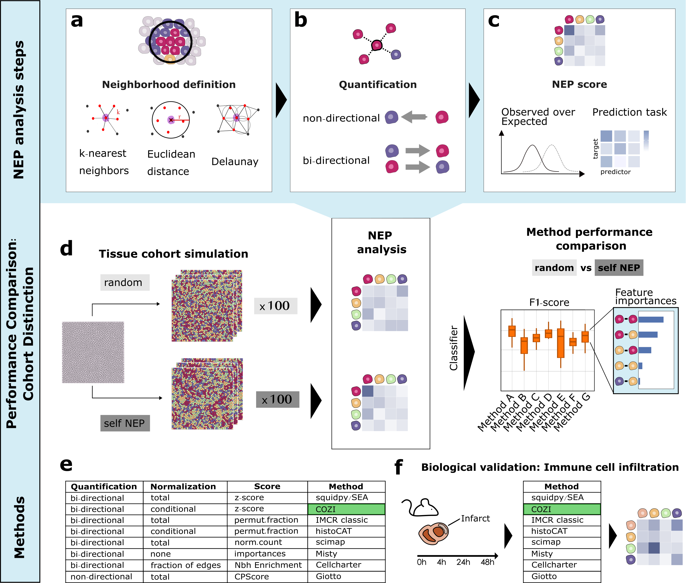

# Comparison and Optimization of Cellular Neighbor Preference (NEP) Methods for Quantitative Tissue Analysis
Author: Chiara Schiller

## Introduction
Studying the spatial distribution of cell types in tissues is essential for understanding their function in health and disease. A widely used spatial feature for quantifying tissue organization is the pairwise neighbor preference (NEP) of cell types, also termed co-occurrence or colocalization. Various methods to infer NEPs have proved their utility in numerous biological studies, but despite their broad usage in the spatial biology community, no clear guidelines exist for selecting one method over the other. In this github repository, we study the methods on two aspects: (1) their discriminatory power to distinguish different tissue architectures and (2) their ability to recover the directionality of NEPs. We conducted method performance comparison with in silico tissue simulated data and showcased its biological applicability to a myocardial infarction dataset studying immune cell infiltration. The method results used in this github repository can be generated with the linked method specific github repositories.

## This repository
We systematically compared the NEP methods Giotto, IMCRtools (classic and histoCAT), MISTy, SEA, Squidpy, Scimap, CellCharter and our newly proposed method COZI. In this repo, we load the NEP results of different tissue organization cohorts (repo: IST_generation) and perform binary classification between two cohorts with differing tissue organization parameters. We perfom the classification with a random forest classifier. Further, we evaluate the distinction performance with the F1 score and the cosine similarity between the feature importances and ground-truth cell-cell adjacency vectors. We further explore the NEP methods on a myocardial infarction (MI) dataset

### Structure

`/notebooks`: 
- `/IST_data_comparison`
    - `/NEP_symmetric_IST_comparison.Rmd`: Loads all NEP result files of the symmetric IST cohorts, performs cohort classification and contains all code to reproduce the Figures in the Schiller et al. (2025) manuscript. 
    - `/NEP_asymmetric_IST_comparison.Rmd`: Loads all NEP result files of the asymmetric IST cohorts, performs cohort classification and contains all code to reproduce the Figures in the Schiller et al. (2025) manuscript. 
    
- `/MI_data_comparison`:
    - `/NEP_MI_heart_comparison.Rmd`: Loads all NEP result files of the MI dataset, explores the raw NEP scores of NEPs of interest and contains all code to reproduce the Figures in the Schiller et al. (2025) manuscript. 
    - `/MI_heart_scatterplots.ipynb`: Script for generating MI data scatterplots in Figure 4a,b and the image in Figure 7a.
    - `/MI_heart_scatterplots_env.yml`: Environment file for generating conda env for generating the result in `/MI_heart_scatterplots.ipynb`
    
`/scripts`: 
- `/interaction_scores_plot.R`: Creates figures for raw NEP score comparison of the symmetric cohort (Figure 2c in manuscript).

`/images`: 
- `/fig1_overview.png`: Overview image Figure 1. 

### Dependencies

Dependencies for R performance comparison analysis are specified in sample_info.txt. 
Dependencies for python MI scatterplots are specified in /notebooks/MI_data_comparison/MI_heart_scatterplots_env.yml

### Data

#### NEP analysis results of the compared methods

NEP analysis results of simulated and MI data were generated using the listed repositories. 

- https://github.com/SchapiroLabor/NEP_Giotto (Giotto)
- https://github.com/SchapiroLabor/NEP_IMCRtools (IMCRtools classic and histoCAT)
- https://github.com/SchapiroLabor/NEP_Scimap (COZI, SEA and Scimap)
- https://github.com/SchapiroLabor/NEP_Squidpy (Squidpy, CellCharter and cell and interaction counts)
- https://github.com/SchapiroLabor/NEP_MistyR (MistyR)

#### MI data

Sequential Immunofluorescence data was accessed via Synapse (project SynID : syn51449054): https://www.synapse.org/Synapse:syn51449054. The dataframe with phenotypes was accessed within the project at:  https://www.synapse.org/Synapse:syn65487454.

