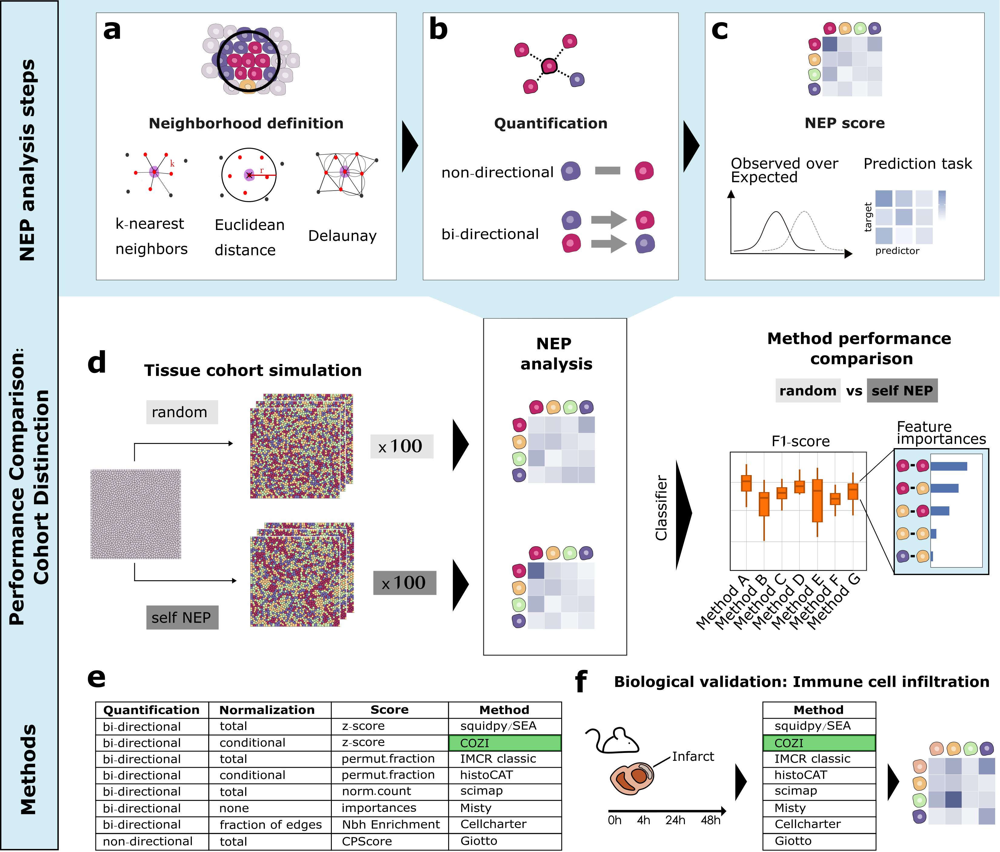

# Comparison and Optimization of Cellular Neighbor Preference (NEP) Methods for Quantitative Tissue Analysis

Studying the spatial distribution of cell types in tissues is essential for understanding their function in health and disease. A widely used spatial feature for quantifying tissue organization is the pairwise neighbor preference (NEP) of cell types, also termed co-occurrence or colocalization. Various methods to infer NEPs have proved their utility in numerous biological studies, but despite their broad usage in the spatial biology community, no clear guidelines exist for selecting one method over the other. In this github repository, we study the methods on two aspects: (1) their discriminatory power to distinguish different tissue architectures and (2) their ability to recover the directionality of NEPs. We conducted method performance comparison with in silico tissue simulated data and showcased its biological applicability to a myocardial infarction dataset studying immune cell infiltration. The method results used in this github repository can be generated with the linked method specific github repositories.

## This repository
We systematically compared the NEP methods provided by Giotto, IMCRtools (classic and histoCAT), MISTy, SEA, Squidpy, Scimap, CellCharter and our newly proposed method COZI. In this repo, we compare NEP results across different methods and datasets by performing binary classification between two cohorts with differing tissue organization parameters. We evaluate the distinction performance with the F1 score and the cosine similarity between the feature importances and ground-truth cell-cell adjacency vectors. We further explore the NEP methods on a myocardial infarction (MI) dataset and provide scripts for plotting here. 

## Reproducibility

Scripts to reproduce the NEP comparison results in Figures 2, 3 and and 6 can be found in this reporisory after generating the NEP results as described below.

Scripts to reproduce the results in Figure 4 and 5 are in https://github.com/SchapiroLabor/NEP_Scimap, as they only include COZI and SEA methods.

### Dependencies

Dependencies for R performance comparison analysis are specified in sample_info.txt. 
Dependencies for python MI scatterplots are specified in /notebooks/MI_data_comparison/MI_heart_scatterplots_env.yml

### NEP analysis results for comparison

All NEP method results were stored as sample by interaction .csv file in one csv_dir for loading into the comparison scripts in this repository. 
NEP analysis of simulated and biological data was performed and is
 described in the method specific linked repositories. 

- https://github.com/SchapiroLabor/NEP_Giotto (Giotto)
- https://github.com/SchapiroLabor/NEP_IMCRtools (IMCRtools classic and histoCAT)
- https://github.com/SchapiroLabor/NEP_Scimap (COZI, SEA and Scimap)
- https://github.com/SchapiroLabor/NEP_Squidpy (Squidpy, CellCharter and cell and interaction counts)
- https://github.com/SchapiroLabor/NEP_MistyR (MistyR)

### Data

#### Simulated data

- The IST simulated data can be found here https://github.com/SchapiroLabor/NEP_comparison/tree/main/simulated_data, or can be generated as described here: https://github.com/SchapiroLabor/NEP_IST_generation. 
- The SpaSim simulated data can be found here https://github.com/SchapiroLabor/NEP_comparison/tree/main/simulated_data, or can be generated as described here: https://github.com/SchapiroLabor/NEP_SpaSim. 

#### Biological data

Sequential Immunofluorescence data was accessed via Synapse (project SynID : syn51449054): https://www.synapse.org/Synapse:syn51449054. The dataframe with phenotypes was accessed within the project at:  https://www.synapse.org/Synapse:syn65487454.
The TNBC data can be found at https://www.angelolab.com/mibi-data. We used the processed data from https://github.com/psl-schaefer/report/tree/master/data.

### Structure of this repository

`/notebooks`: 
- `/IST_data_comparison`
    - `/NEP_symmetric_IST_comparison.Rmd`: Loads all NEP result files of the symmetric IST cohorts, performs cohort classification and contains all code to reproduce Figure 2 in the Schiller et al. (2025) manuscript. 
    - `/NEP_asymmetric_IST_comparison.Rmd`: Loads all NEP result files of the asymmetric IST cohorts, performs cohort classification and contains all code to reproduce Figure 3 in the Schiller et al. (2025) manuscript. 
    
- `/MI_data_comparison`:
    - `/NEP_MI_heart_comparison.Rmd`: Loads all NEP result files of the MI dataset, explores the raw NEP scores of NEPs of interest and contains all code to reproduce Figure 6 in the Schiller et al. (2025) manuscript. 
    - `/MI_heart_scatterplots.ipynb`: Script for generating MI data scatterplots in Figure 6a,b and Supplementary Figure . Also generates the image in Figure 8c.
    - `/MI_heart_scatterplots_env.yml`: Environment file for generating conda env for generating the result in `/MI_heart_scatterplots.ipynb`
    
`/scripts`: 
- `/NEP_selfpref_scores_plot.R`: Creates plots for Figure 2c for distribution of raw NEP scores of the red cell type's self-preference in the symmetric cohort.
- `/overall_NEP_scores_plot.R`: Creates plots for Supplementary Figure 3 for distribution of all raw NEP scores of the symmetric cohort across methods.

`/images`: 
- `/Figure1.png`: Overview image Figure 1.

`/simulated_data`: 
- `/asym01_nbh2_1000dim_grid200_300iter_50swaps.zip`: Stored IST simulated data, asymmetric cohort.
- `/sym00_nbh2_1000dim_grid200_300iter_50swaps.zip`: Stored IST simulated data, symmetric cohort.
- `/spasim_data.zip`: Stored SpaSim simulated data.

## Citation
Schiller et al. Comparison and Optimization of Cellular Neighbor Preference Methods for Quantitative Tissue Analysis. bioRxiv (2025) [doi:10.1101/2024.12.20.629764](https://doi.org/10.1101/2025.03.31.646289)

